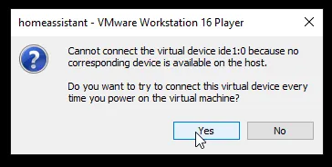

# Feature test

## Rhasspy
https://rhasspy.readthedocs.io/en/latest/

Installation via docker on a Linux server is easy, on a windows docker platform, I haven't been able to make it start (need a profile that I don't know how to include in the command). For the rest, the tool is an aggregation of different tools that provide each a functionality :
- Speak to text
- Text to speech
- Audio input
- Audio output
- Wake word

The tool itself looks nice and we can create sentences that can be recognized by rhasspy and perform an action. 
I couldn't make the microphone and audio work so impossible to test at the moment. 

I realize that microphone has to be plugged in where the docker rhasspy server is hosted. Need troubleshooting audio input.

## Home Assistant installation Virtual Machine

I tried Home Assistant on docker version. And it is very easy to install : https://www.home-assistant.io/installation/
But I realized that I am not able with docker version to access addons. Addons is only avaialbe when installing Home Assistant as a VM (Kvm, vmware, virtualbox) or via the raspberry installer. That's probably why there is so much people installing HA from RP4. 

I continued my search on Vmware home assistant, the VM version is quite complex to install, need to follow this steps : 
 Download Home Assistant .VMDK image
Download the Vmware Workstation (.vmdk) image from here: https://www.home-assistant.io/installation/windows

The file will be download as a file with a .xz extension which needs to be extracted. To extract it:
Download 7zip.
Right-click the hass_ova-5.12.vmdk.xz file you just downloaded > 7zip > Open Archive.
Then, click Extract. It should extract to a .vmdk file.
Rename the file to something like homeassistant.vmdk, and place it into a directory where your VM will live (C:\HomeAssistant)
Step 3: Launch VMware Workstation 16 Player
Search your computer for VMware Workstation 16 Player and open. Select the free for non-commercial use option.

Click Create a New Virtual Machine
Click I will install the operating system later.
Select Linux. For the version, you would use Other Linux 5.x and later kernel 64-bit.

Give your VM a name (like homeassistant) and select the folder you created in Step 2.

Store it as a single file, and set your storage size. I chose 20gb.

On the next screen, click Customize Hardware. Memory and CPU can be specified to whatever you want (1gb of RAM and 1CPU is recommended), but the network adapter needs to be set to “bridged” mode.
Memory: 2048
CPU: 2
Network Adapter: Choose “Bridged”
Your VM should now be created.
Step 4: Edit VM Settings
Navigate back to the C:\HomeAssistant folder. You will now see two .vmdk files:

Delete the homeassistant-0 one (the newly created .VMDK), and rename the homeassistant one to homeassistant-0 (this is the extracted image you downloaded).
Then, locate the homeassistant VMware virtual machine configuration file (.vmx). Right-click > Open With > notepad.

Under the .encoding line, add the following code and save the file.
firmware="efi"

Step 5: Start the Virtual Machine
Then, click Play Virtual machine or click the green triangle at the top of the window.
If you see this message, click Yes.

Download and install VMTools. I’m not entirely sure if this was necessary, but I did it anyway:

If everything is successful up until this point, you should see the Home Assistant login screen in a command window like below.
The default username is root. Logging in will show you your IP address of your new HA virtual machine. In my case, it is 192.168.68.128. It’s not necessary to login if you can get your IP from your router.

At this step, you should be able to navigate to http://192.168.68.128:8123 in a web browser. The HA gui will state that it may take up to 20 minutes to complete, but in my experience it took less than 5.
While you are waiting, remove your Nortek GoControl zwave/zigbee USB stick from your raspberry pi and plug it into your Windows 10 PC that has VM Workstation Player installed. Windows should detect it automatically and install all necessary drivers.

The VMware VM should automatically detect it as well:

Once the “it may take 20 minutes to complete” screen goes away, you will see the New User Account screen like the screenshot below. I am restoring from a previous snapshot, so I’m going to choose Alternatively, you can restore from a previous snapshot.

After restoring from snapshot, you may notice all of your wifi devices work – but zwave and zigbee devices don’t. This is because we need to “attach” the Nortek USB dongle to the vm (referred to as USB passthrough).

To do this, on the VMware Player window, select Player > Removeable Devices. There should be two Silicon devices.

Click each of them > Connect.

Testing It Out
If all has gone well so far, you can now test things out. Toggle a few lights, switches, and motion sensors. If you have any secure nodes, like a smart door lock, you should test those as well.
The last thing you’ll need to do is either the change the internal IP address in your Home Assistant Mobile app (under App Configuration in the sidebar) or change the IP address of your VM to the old IP address.
Wrapping Up
All in all, I spent entirely too much time trying to figure out all the nuances of getting this working, particularly extracting the .vmdk file, deleting the old .vmdk, and then discovering that I needed to edit the .vmx file to allow it to secure boot.

So, I decided to document each step of the process as I went, with the hopes that it’ll help someone else out who is looking to migrate or fix their zwave issues. Like I said, everything just worked, and I didn’t have to reconfigure or repair a single device after migrating to Vmware.
If you get it working after following my guide, let me know in the comments!
Additional Steps (optional)
Click this link to run VMware Workstation 16 in the background and automatically after restarting.
Or, if you want to automatically connect your USB dongle to a VMware Workstation VM.
My Favorite Home Assistant Devices
Below are some of the Home Assistant-compatible devices I personally use in my home. I highly recommend each of them.
Zwave/Zigbee hub: Nortek GoControl HUSBZB-1
Smart Plugs: Securifi Peanut plugs 
Motion Sensors: Hue Indoor Motion
Outdoor Camera: Amcrest IP5M Turret 
Robot Vacuum: Roborock S7
The full list of all Home Assistant compatible & recommended devices I use can be found on my Equipment List page.

# Alexa
I wanted to try Alexa as well to make the voice assistant process easier to install. There are a few statements here I need to remember:
Cons
- Requires internet to use it all the time
- Need Amazon account to work
- Cost money to have in each room
Pros
- Nothing to install it's premade
- No skill to develop
- Can be integrated for free with Dev lambda function in-home assistant : 

I've been able to integrate Alexa to Home Assistant and discover my different entities into Alex autodetected. I am using the Lambda function to discuss with the Home assistant. And an Alexa developer account as well. I used Instana AWS account for test but in the futur I will need to use my own account. This solution is 100% FREE. 

I need a function lambda code: https://gist.github.com/matt2005/744b5ef548cc13d88d0569eea65f5e5b
A lambda test code (the quoted code with directive on top): https://www.home-assistant.io/integrations/alexa.smart_home/#test-the-lambda-function 
Follow this video: https://www.youtube.com/watch?v=Ww2LI59IQ0A&t=389s&ab_channel=EverythingSmartHome

There is a bit of port forwarding to do (NAT) explained in the video above. Virgin media hub box is not able to forward mutliple ports to the same 8123 ports. So the idea is actually to forward only the port 443 to 8123. It also means that Homeassistant will be only reachable on 443 and not on 8123 anymore. 
The difficult parts seems to be the lambda code to test. You can get different error like 401 not authorized because toekn is missing or 404 not found when Alexa is not recognized inside the configuration.yaml file inside Home Assistant.

During this test I made use of duckDNS to obtain global IP instead of my local LAN 192.168.0.27. see DuckDNS test. 

Connecting Home Assistant to send text to speech to Alexa 

requirements:
Amazon echo
HACS (Home Assistant community Store):https://hacs.xyz/ 
Multi-Factor authentication on Amazon account
Alexa paired to Home assistant (see above) 
text to speech: https://www.youtube.com/watch?v=UsnhL2z_UUY&t=571s 

To send a notification, go to https://havient.duckdns.org/developer-tools/service and select in the search notify. A combo box will appear and select the devices Alexa where to send the notification. all is optional exept data = "type: tts" without the quote.

I need to check if alexa can say some infomration regarding the house;
door is open
TV movie is ready to watch

Waze timer between 2 distances

Waze timer between 2 distances. this is 

Next: how can we MQTT intent from Alexa to a MQTT broker ?
What is compatible ?
How to 

https://www.youtube.com/watch?v=AK5E2T5tWyM&ab_channel=EverythingSmartHome
https://www.duckdns.org/
I used my personal gmail account to create the dynamic dns link between home assistant and exernal public network.

Duck DNS allows to get a single URL to reach Home assistant. I followed the youtube video, is it straight forward. As explained in Alexa test, Virgin media cannot let us portforward (NAT) multpile ports to one ports so I've chossen to port all on 443 (as required for Alexa lambda function). 

5 Back up and restore Home Assistant

Backup of your Home Assistant and add-on data and configuration. They are stored in a compressed archive file (.tar). Backups are made from the Supervisor Backups panel. There is also a service available that allows you to trigger the creation of a backup from an automation. Backups are stored in the /backup directory.
A full backup includes the following directories:
config
share
addons (only manually installed or created add-ons, not those installed from the store)
ssl
media
A partial backup consists of any number of the above default directories and installed add-ons.
