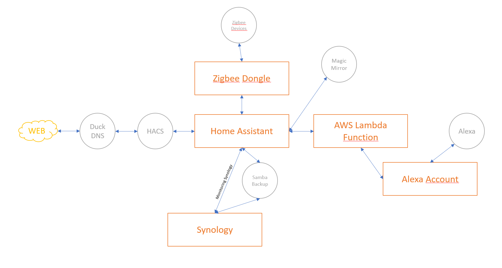

# Home Assistant
The project is the beginning of a new way of living. Where I would like to create an automated house capable of understanding my family behaviour and react to the needs of everyone to facilitate our life at home. The document will describe what I would like for my family and different house area. Moreover the different technology I am able to use, test I did to best fit our needs.
 
## Links and information to keep
- [Self hosted list of service](https://github.com/awesome-selfhosted/awesome-selfhosted)
- Websocket 
    - https://github.com/tripleee/websocketd-alpine 
    - https://github.com/joewalnes/websocketd 

## Specification and Requirements
- [Mural](https://app.mural.co/invitation/mural/instana2043/1662101641691?sender=ud390ebff24a87cb50d5c4178&key=ab0fbe28-410d-4aef-b900-dc734c1fa7b7) (IBM Account Mural)
- [Project Trello](https://trello.com/b/m6jvqlUx/home-assistant) (normal Account trello)

 
## Requirements
- I want to use new technology in a containarized environnement
- Use of kubernetes if possible to also learn K8S on a personnal project
- Vocal system to execution automation and task
- Low powered system to hosts the platform (e.g raspberry)
  
##  Specification:
 
- A reliable hardware infrastructure to host all the system
- A secured software plateform easy to run, maintain
- A backup and recovery system
- A security Alarm and Camera
- A secured network where I can have a good bandwith for internet, gaming, movie and another dedicated local dedicated network to mangage devices
- I want to be able to talk to the system, it needs to understand Polish and French language.
- I need the least effort to integrate sensors and devices
- If possible I would like to integrate all data to a single bus where I can ingest data, listen, and automate task
- If the system can stay secured locally and no data sent to the cloud, it is a plus.
- Ability to send a reminder that desktop is ON upstairs and nothing moved for the last X hous or minutes to save energy bill.
- Ideas provided by Joanna
    - The system should discovere himself who left the bed in the morning
    - Find a solution to indicate your mood / to change the music in the morning or add a orange juice to      your coffee.
    - Light during the night detected by presence to go to the toilet with a light dimmer maybe ?
    - Voicie calendar assistant that tells you RDV and task reminder ("time to buy christamas      present")
    - Smart mirror that give you the weather
    - System able to match the purfum with the weather
    - Wardrobe assistant to match weather
    - Water in the shower is nearly cold so please wake up
    - Wake up dynamically depending on calendar task of the family and
    - Breakfast assistant depending on what's in the fridge
    - Shopping list assistant
    - Key detector inside the car, to stop forgetting keys in the car
    - Door detector to make sure all is closed when leaving/going to bed
    - Miror to compliment my beauty :)
    - System that assist baby when he wakes up before parents, with light or a tv program or something else
    - Mirror that tell me to shave my beard
    - Security system on demand that record movement outside the house with 7 days retention
    - GPS tracking
    - The system has to be zone tracking instead of continuous tracking
    - Adult zone tracking
    - Home zone, to notify when we are at home
    - Kids zone tracking
    - Notify when kids are at home, school area, friends house, sport area
    - Health for kids - Can we  track emotional behaviour of the kid ? If hearbit to high, expecting call      from school ?
    - Christmas mode(scene) : House with christmas music and light starting in the morning
    - Push notification when new informations from school

## Architecture
A home assistant can be a wide topic and cover a lot of area but I will maintain the scope to the following that are in my requirements:
 
- An Infrastructure to host all these developpements plateform (probably raspberry pi and K3S cluster)
- A docker environment to easily manage all software stack present in the infrastructure
- A backup and receovry system, to maintain sustanbility over time and reduce human errors.
- A security system Alarm and Camera
- A secured network using a VPN ?
- A hub to manage devices and create automation.
- A vocal assistant to recognise different language and translate voice to task, script and automation
- Devices to take remote actions
- Sensors to acquire the signal
- Home Energy Management
 

 

